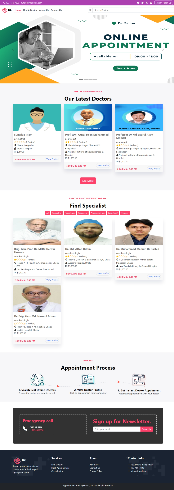
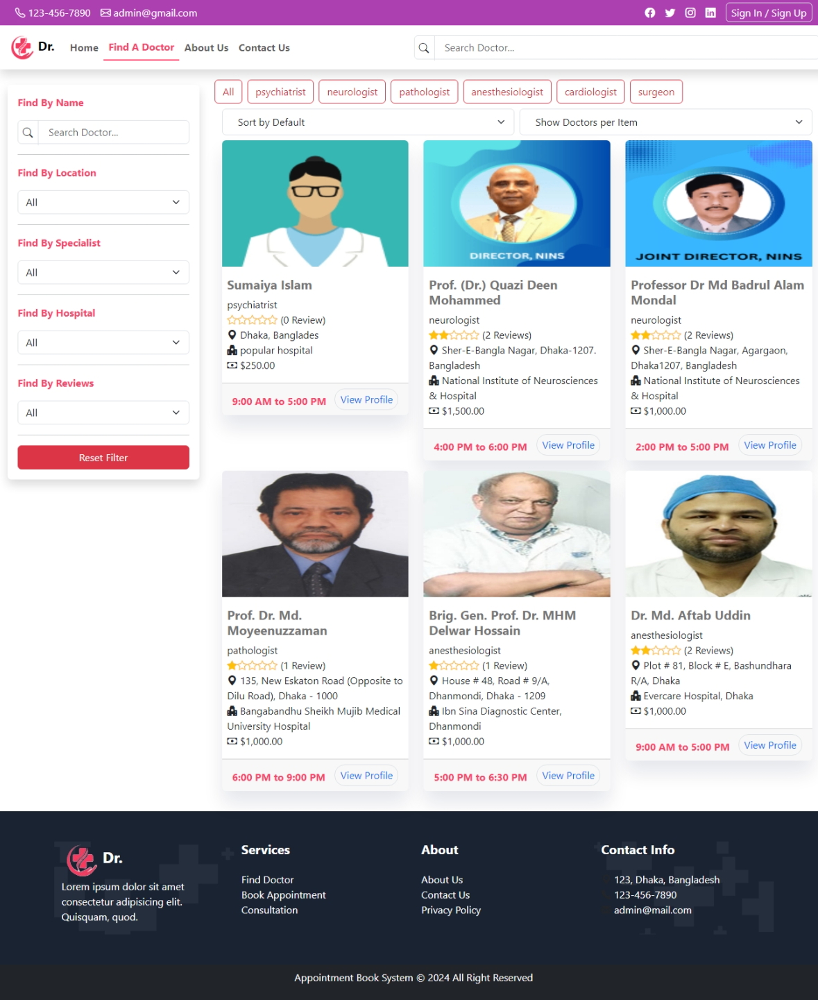
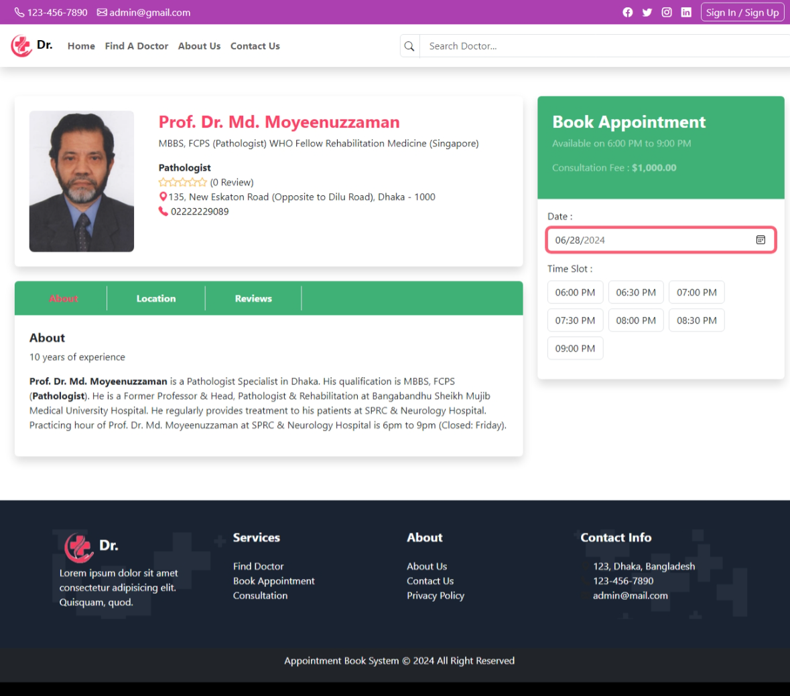

# Doctor appointment booking system using React.js and Node.js
This is a simple doctor appointment booking system using React.js and Node.js. The frontend is built using React.js and the backend is built using Node.js. The backend is a simple REST API that serves the frontend. The frontend is a single page application that allows users to book appointments with doctors. The appointments are stored in a MongoDB database. 

## Installation
To run the project, you need to have Node.js and MongoDB installed on your machine. You can download Node.js from [here](https://nodejs.org/en/) and MongoDB from [here](https://www.mongodb.com/). Once you have Node.js and MongoDB installed, follow the steps below to run the project:

1. Clone the repository
```
git clone https://github.com/Volodymyr-Karabash/Django-React-Appo.git
```

2. Go to the project directory
```bash
cd Hospitality-Business
```
3. Install the dependencies
```bash
cd frontend
npm install
```
```bash
cd backend
npm install
```
4. Start the backend server
```bash
cd backend
npm start
```
5. Start the frontend server
```bash
cd frontend
npm run dev
```
6. Open your browser and go to for the backend `http://localhost:3000` and for the frontend `http://localhost:5173` to see the project running.


## Screenshots




## Features
- Book appointments with doctors
- Book appointments for specific dates and times with time slots
- View appointments
- Cancel appointments
- Responsive design


## Technologies
- React.js
- Node.js
- MongoDB
- Express.js
- Bootstrap
- HTML JSX
